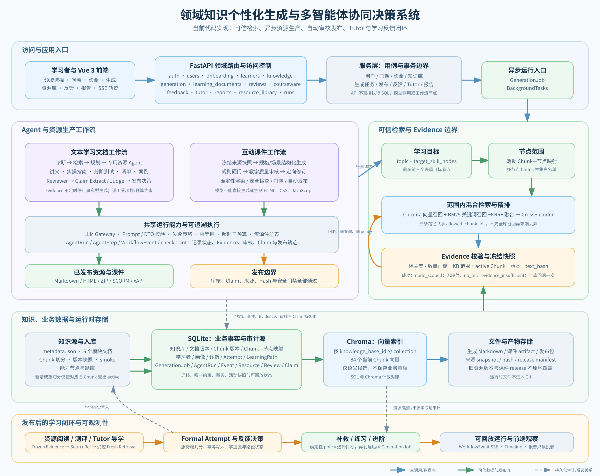
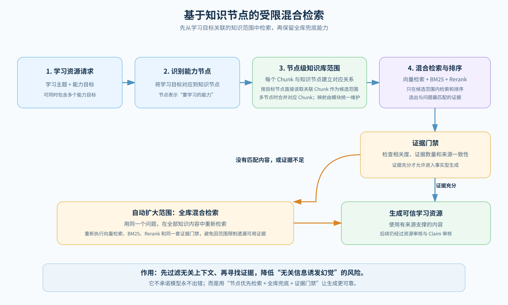
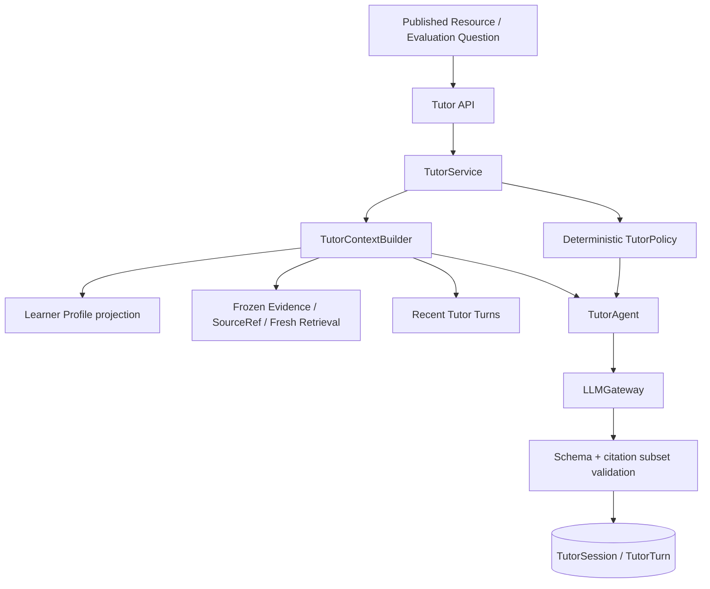

# 总体架构文档

> 项目编号：XH-202630  
> 项目名称：领域知识个性化生成与多智能体协同决策系统  
> 文档版本：2.4
> 文档更新时间：2026-08-29
> 文档定位：描述当前代码库的真实分层、模块边界、运行路径与主流程。

## 0. 整体架构总览



图中蓝色箭头表示主调用或数据流，绿色箭头表示可信知识/发布链路，虚线表示持久化
审计与反馈关系。它描述当前本地 SQLite + Chroma 部署的实际代码边界，不表示已完成
分布式队列、生产级 PostgreSQL、高可用或自动恢复承诺。

## 1. 架构目标

系统当前面向“多领域培训”场景，围绕以下闭环组织：

```text
用户资料维护
-> 领域选择
-> 学习方向选择
-> 初始画像问卷
-> 诊断测评
-> 个性化资源生成
-> 审核与证据
-> 学习反馈
-> 学情报告
```

其中：

- “学习方向”是前台和流程入口概念。
- `knowledge_base_id` 是后端内部的稳定知识边界。
- 用户长期稳定信息由用户资料维护，不再放入通用问卷。
- 问卷负责构建初始画像中的动态学习信息。
- 诊断负责测量真实掌握情况并回写画像。

## 2. 当前代码分层

| 层级 | 目录 | 当前职责 |
|---|---|---|
| 前端界面层 | `frontend/src/` | 用户资料、领域/方向选择、问卷、诊断、历史记录、资源查看、报告展示 |
| API 路由层 | `backend/app/api/` | FastAPI 路由、参数接收、响应模型与错误映射 |
| 业务服务层 | `backend/app/services/` | 用户资料、问卷组装、画像创建、诊断判分、资源生成、反馈处理、报告构建 |
| 多智能体层 | `backend/app/agents/` | LangGraph 工作流及诊断、检索、规划、生成、审核、反馈等 Agent 节点 |
| 基础设施层 | `backend/app/core/` | LLM、Embedding、向量存储、知识库读取、文件存储 |
| 数据访问层 | `backend/app/db/` | 当前 SQLite 仓储、ORM 模型、幂等表初始化与分领域仓储；保留的 PostgreSQL 方言分支属于未验收的可选兼容代码 |
| 数据模型层 | `backend/app/models/` | Pydantic schema 与核心数据结构 |
| 工具层 | `backend/app/utils/` | 项目内部复用工具函数 |
| 脚本层 | `scripts/` | 初始化数据库、导入知识库与问卷/诊断源数据 |
| 知识源层 | `knowledge_base/` | 学习目录源文件、方向知识库元数据、问卷源文件、诊断题源文件 |

## 3. 当前后端模块

### 3.1 API 路由

`backend/app/api/` 按领域包组织。路由实现位于
`admin/`、`auth/`、`courseware/`、`feedback/`、`generation/`、
`knowledge/`、`learners/`、`learning_documents/`、`onboarding/`、
`reports/`、`resource_library/`、`reviews/`、`runs/`、`skills/`、
`tutor/` 和 `users/`；跨路由认证与访问控制依赖位于
`api/dependencies.py`。

说明：

- 画像接口统一收敛在 `/api/profiles/*`。
- 用户基础资料接口统一收敛在 `/api/users/*`。
- 学习历史时间线接口统一收敛在 `/api/learning-history/*`。

### 3.2 服务层

`backend/app/services/` 同样按领域包组织，包含 `auth`、`courseware`、
`feedback`、`generation`、`knowledge`、`learners`、`learning_documents`、
`onboarding`、`reports`、`resource_library`、`reviews`、`runs`、`tutor`
和 `users`。每个包只暴露该领域的用例编排与查询门面。

职责划分：

- `knowledge`、`onboarding`、`learners` 和 `users`：目录、问卷、画像、诊断和用户资料用例。
- `generation`、`learning_documents`、`reviews` 和 `runs`：文本学习文档的任务、发布、审核与运行记录。
- `courseware`：互动课件任务、恢复、发布和 Worker 执行门面。
- `feedback`、`tutor`、`reports` 与 `resource_library`：生成后的学习闭环、只读聚合和资源路由。

### 3.3 Agent 层

`backend/app/agents/` 保持以下边界：

- `resource_workflows/learning_documents/`：五类文本学习文档的工作流和节点。
- `resource_workflows/interactive_courseware/`：互动课件工作流、状态、专用 Agent 与 Worker。
- `learning_agents/`：诊断、反馈策略与 Tutor 等学习闭环 Agent。
- `resource_agents/`：五类文本资源与纠错训练包的专用生成 Agent。
- `shared/`：不依赖具体资源领域的纯共享能力。

当前代码含义：

- Agent 负责协同推理和多步生成。
- 服务层负责把 Agent 与数据库、画像、资源记录串起来。
- 版本化工作流状态、Agent 契约和共享枚举位于 `models/shared/`；资源领域 DTO 位于各自的 `models/<domain>/`。
- 文本资源工作流仅编排 Spec、受限并发、失败隔离、产物物化和 trace；正文 Prompt 位于 `resource_agents/`。
- 公共资源类型词汇由 `models/learning_documents/` 唯一定义。当前路由为 `讲义 -> TextResourceAgent`、`实操指南 -> PracticeGuideAgent`、`分阶测试题 -> AssessmentAgent`、`复习清单 -> ReviewChecklistAgent`、`案例分析 -> CaseStudyAgent`，唯一别名为 `定制讲义 -> 讲义`。
- 反馈闭环可额外创建专属 `个性化纠错训练包 -> CorrectionTrainingPackageAgent`。它在学习文档内部受支持，但不属于普通生成词汇；`FeedbackService` 验证强化候选和快照后才可创建，并只向 Agent 传入脱敏目标、教学策略、达标标准和冻结 Evidence。

## 4. 当前主流程调用链

### 4.1 用户资料、画像与诊断

```text
frontend
-> POST /api/users/
-> GET /api/knowledge/domains
-> GET /api/onboarding/questions?learning_direction_id=...
-> POST /api/onboarding/initial-profile
-> POST /api/diagnosis/submit
-> users / learner_profiles / questionnaire_* / diagnostic_* 落库
```

说明：

- 用户的 `identity`、`education`、`major` 等稳定信息先进入 `users`。
- 通用问卷只负责当前学习方向的动态信息，不再重复采集稳定资料。
- `onboarding_service` 会优先使用用户资料中的 `identity` 回写画像的 `learner_type`。

### 4.2 生成与反馈

```text
frontend
  -> HTTP
backend/app/api
  -> 调用服务
backend/app/services
  |- generation_job_service: 创建异步任务、查询状态、后台执行
  |- generation_service: 先执行 readiness gate，再调用多 Agent 生成闭环并保存资源
  |- feedback_service: 提交正式 Attempt，执行确定性反馈策略并协调事务与后续生成
  |- learning_path_policy: 校验并生成路径状态变更
  |- report_service: 聚合画像、资源、Attempt、版本历史和持久化路径
  ->
backend/app/agents
  |- diagnosis: 学情诊断 Agent
  |- retriever: 知识库检索 Agent（BM25 + Chroma 向量召回 + RRF 融合 + CrossEncoder 精排）
  |- planner: 学习路径规划 Agent
  |- generator: ResourceSpec 编排与受限并发，不持有通用正文 Prompt
  |- resource_agents: 按 resource_type 精确路由的专用生成 Agent
  |- reviewer: 审核纠偏 Agent
  |- feedback: 反馈决策 Agent
  |- claim_review: 独立 Claim 抽取、冻结 Evidence 判定与确定性指标
  |- workflow: 审核开关、Claim 返工闭环、返工额度与终态决策
  ->
backend/app/core + backend/app/db
  |- RuntimeHealth / failure policy / LLM / Embedding / ChromaDB / 知识库 / 文件存储
  |- Repository / ORM / SQLite or Memory
```

生成请求进入工作流前，由 `generation_service.build_workflow_state()` 完成唯一映射并生成 `run_id`。当前对外生成入口已经统一为异步任务模式：

```text
POST /api/generate/jobs
-> GET /api/generate/jobs?learner_id={learner_id}
-> BackgroundTasks 触发 generation_job_service.run_job(...)
-> 任务状态通过 GET /api/generate/jobs/{run_id} 查询
-> 结果通过 GET /api/resources/{learner_id}?run_id={run_id} 获取
```

运行中遵守以下控制流：

```text
diagnose -> retrieve -> plan -> generate
                                  |- include_review=false -> finalize_draft
                                  |- include_review=true  -> review
                                                               |- approve + include_claim_check=true
                                                               |     -> claim_extract -> claim_judge -> claim_decide
                                                               |            |- 通过 -> finalize
                                                               |            |- 问题 Claim 且有额度 -> prepare_revision -> generate
                                                               |            |- 失败/额度耗尽 -> finalize(human_review)
                                                               |- approve + include_claim_check=false -> finalize
                                                               |- revise 且有额度 -> prepare_revision -> generate
                                                               |- reject/额度耗尽 -> finalize
finalize -> END
```

资源生成内部链路：

```text
GenerateRequest 请求校验与类型规范化
-> ResourceSpec Builder 冻结 type/family/evidence/knowledge points/budget
-> Generator 为每个 Spec 分配独立 worker_step_id，并以最大并发 2 调用专用 Agent
-> Reviewer 按文本资源独立审核；Claim 启用时也按资源调用
-> 已批准资源立即发布，不等待同批其他资源
-> 已批准且已发布的资源可立即阅读
```

每个资源仅保留 `representation=text`。数据库以 `(run_id, resource_spec_id, representation)` 唯一标识当前执行投影，以 `(run_id, resource_spec_id, representation, version)` 约束资源版本。

### 4.3 P0-07 反馈后真实闭环

```text
POST /api/feedback/attemptsattempts
-> 校验 learner、published source resource/version、稳定知识点与请求分数
-> 读取 profile_version、knowledge state、最近趋势和当前 path
-> deterministic policy
   |- overall < 0.60 或任一点 < 0.60 -> remediate
   |- 0.60 <= overall < 0.80        -> practice
   |- overall >= 0.80 且无 blocker  -> advance
-> Transaction A
   |- learning_attempts + point_results
   |- feedback_decisions
   |- knowledge_states + mutation history
   |- learner_profiles.profile_version + version history
   |- learning_paths/nodes + path mutation
-> commit
-> remediate/advance 时幂等创建现有 generation job
-> 保存 parent run / attempt / decision / child run 关系
-> BackgroundTasks 调用 GenerationJobService.run_job
-> 新 Run 继续经过 Evidence、Review、Claim Audit 和 Publication Gate
```

知识点掌握度采用可解释 EWMA：已有状态为 `0.2 * old + 0.8 * attempt_score`，让最近一次客观测评占主要权重；首次作答直接取 attempt score。hint 与 duration 仅进入决策上下文和审计，不暗中改变 mastery。每次成功更新将画像版本从 N 变为 N+1，并以 `expected_profile_version` 做 CAS；重复请求不会再次加权。

路径 mutation 由 policy 生成并校验自环、缺失前置条件、环路和重复节点。低分插入/复用 remedial，中分插入/复用 practice，高分完成当前节点并解锁满足前置条件的下一节点；无下一节点时增加 challenge。路径只有实际变化才递增版本。

Follow-up 属于 after-commit 副作用。Claim 关闭时一次选择保持单 Run 多资源；Claim 开启且多资源时按资源类型创建独立 Run。每个 Run 绑定同一 Attempt/Decision；资源页追加创建 `continuation` 关系，失败重试创建新的 `retry` 关系并保留失败来源。创建失败时 Attempt 保持 `applied`、关联状态为 `failed`，相同幂等请求可安全对账重试。反馈事件只存稳定 ID、计数、分数摘要、action/reason code 和版本，不保存完整答案、画像、Prompt 或模型原文。

### 4.4 P0-08 WorkflowEvent SSE

```text
业务动作 / Agent step
-> 资源、审核、Claim、状态事实先持久化
-> WorkflowEvent append + commit
-> RunEventStreamService 短事务查询 event_sequence > cursor
-> public allow-list mapper
-> StreamingResponse(text/event-stream)
-> EventSource
-> sequence-deduplicating reducer
-> AgentVisualization realtime timeline
```

WorkflowEvent Ledger 是唯一事件事实源，SSE 只是只读 transport，不创建第二套 UI event 表或进程内 progress ledger。每个 SSE poll 都打开并关闭独立 Repository Session，不在长连接期间持有数据库事务或行锁；同步 SQL 查询通过 thread offload 避免阻塞 ASGI event loop。

连接先发 snapshot，再补发 durable event backlog，最后 live tail。浏览器断线只停止观看，不取消 BackgroundTasks/Workflow；重连使用原 EventSource 的 `Last-Event-ID`，或页面刷新后以 timeline 最后 sequence 作为 `after_sequence`。heartbeat 不进入 Event Ledger。两个客户端独立读取同一 append-only ledger，不存在 delivered/ack 或破坏性消费。

GenerationJob/AgentRun 的 queued 竞态保持现有 ownership：Job 可先存在，SSE snapshot 此时 run_status 为空并等待 AgentRun。P0-08 没有引入 Redis、消息队列、WebSocket、自动 resume/cancel 或 token streaming。

资源事件 payload 只公开 `resource_spec_id`、`resource_family_id`、`resource_type`、`representation`、`resource_execution_state`、`worker_step_id`、`resource_id`、`review_id`、`agent_name`、`prompt_version`、`artifact_format`、`validation_status` 和安全错误码等白名单字段；不下发正文、Prompt 或模型原始响应。前端高层 Agent 流程保持不变，仅在生成/审核节点下展开资源级卡片。

P0-06 的 Claim 抽取器与 Generator 相互独立。模型只能从资源、目标技能节点和当前
Run 的冻结 Evidence ID 白名单中选择；代码负责生成稳定 Claim ID，并校验原文跨度、
资源版本、知识点与 Evidence 边界。判定失败、漏判或伪造 ID 均 fail closed 到
`human_review`。新资源版本必须重新抽取，旧版本判定不会复制。

`max_iterations` 是最大业务返工次数，不包含初次生成；`generation_attempt = revision_count + 1`。技术重试不复用该计数。每次运行、节点执行、资源版本和资源审核分别使用 `run_id`、`step_id`、`resource_id`、`review_id`，ID 在动作开始或结果产生时生成，持久化层不重新生成已有 ID。

### 多 KB collection 与健康检查边界

- 每个 `knowledge_base_id` 通过 `backend/app/core/vector_store.py:_collection_name()` 映射到独立 Chroma collection。
- collection 的创建、写入、查询、删除和 health 均复用该 resolver，`CHROMA_COLLECTION_NAME` 兼容期只作为前缀，不再表示唯一固定集合。
- 公共 `/health` 与 `/health/ready` 只判断默认 KB 和 Python、storage、LLM、Embedding、Chroma 目录、资源目录等核心依赖。
- 管理员 `/api/admin/knowledge-bases/health` 在显式 token 保护下返回所有 KB 的脱敏详情。
- 默认 KB 正常但部分可选 KB 异常时，管理员汇总为 degraded；公共服务不因此返回 503。默认 KB 或 Chroma 核心不可用时才按运行模式进入 degraded/not-ready。

## 5. 当前接口闭环

当前实际对外闭环接口为：

```text
POST /api/users/
-> GET /api/knowledge/domains
-> GET /api/onboarding/questions
-> POST /api/onboarding/initial-profile
-> POST /api/diagnosis/submit
-> POST /api/generate/jobs
-> GET /api/generate/jobs?learner_id={learner_id}
-> GET /api/generate/jobs/{run_id}
-> GET /api/resources/{learner_id}
-> GET /api/resources/file/{resource_id}
-> GET /api/feedback/evaluation/run/{learner_id}/{run_id}
-> POST /api/feedback/attemptsattempts/run/submit
-> POST /api/feedback/attempts
-> GET /api/feedback/attempts/{learner_id}
-> GET /api/learning-history/{learner_id}/timeline
-> GET /api/report/{learner_id}
```

补充接口：

- `GET /api/users/`
- `GET /api/users/{user_id}`
- `PATCH /api/users/{user_id}`
- `GET /api/knowledge/directions`
- `GET /api/knowledge/info`
- `GET /api/skills/nodes`
- `GET /api/diagnosis/questions`
- `GET /api/reviews/{resource_id}`
- `GET /api/generate/jobs?learner_id={learner_id}`
- `GET /api/feedback/evaluation/run/{learner_id}/{run_id}`
- `POST /api/feedback/attemptsattempts/run/submit`
- `GET /api/feedback/attempts/{learner_id}`
- `GET /api/evaluation/summary`

## 6. 当前数据与运行目录

| 路径 | 当前用途 |
|---|---|
| `backend/data/domain_knowledge.db` | SQLite 业务数据库 |
| `backend/data/generated_resources/` | 生成资源文件目录 |
| `backend/chroma_db/` | Chroma 向量索引目录 |
| `backend/logs/` | 运行日志目录 |
| `knowledge_base/learning_catalog_seed.json` | 领域与学习方向目录源文件 |
| `knowledge_base/questionnaire_common.json` | 通用问卷源文件 |
| `knowledge_base/<track>/questionnaire.json` | 方向特定问卷源文件 |
| `knowledge_base/<track>/diagnostic_questions.json` | 方向诊断题源文件 |

说明：

- 当前本地数据库已经按最新模型重建。
- `knowledge_base/questionnaire_common.json` 现已收缩为只保存动态学习信息，不再包含用户长期资料字段。

## 7. 当前目录树摘要

```text
backend/
  app/
    api/
    agents/
    core/
    db/
    models/
    services/
    utils/
    config.py
    main.py
  data/
  chroma_db/
  logs/

frontend/
  src/
    api/
    components/
    composables/
    features/<domain>/
    router/
    stores/
    styles/
    utils/

knowledge_base/
  learning_catalog_seed.json
  questionnaire_common.json
  rag_engineering_training/
  demo_industrial_internet/

scripts/
  init_db.py
  ingest_knowledge.py
```

## 8. 当前约束

### 8.1 命名约束

- 前台流程入口使用 `learning_direction_id`
- 后端内部知识边界保留 `knowledge_base_id`
- 用户资料主键使用 `user_id`
- 学习者画像主键使用 `learner_id`

### 8.2 文档约束

当以下内容变更时，应同步文档：

- 路由文件名或接口路径
- 服务命名
- 主流程步骤
- 数据库存储位置
- 用户资料、问卷与诊断的数据边界

### 8.3 运行约束

- 项目本地接口基地址统一为 `http://127.0.0.1:8000`
- Vite 前端代理应指向 `8000`
- 文档与联调口径均以 `8000` 为准
- 互动课件任务由 `backend/scripts/courseware_worker.py` 的独立 Durable Worker 消费；Web 生命周期不执行课件工作流
- 当前 SQLite 拓扑只运行一个顺序 Worker，默认健康端点为 `http://127.0.0.1:8081`；`/health/ready` 表示完成过持久 outbox 轮询
- 一键本地启动入口为 `python scripts/start_local.py`，完整操作与停机语义见 `docs/deployment.md`

### 8.4 当前实现边界

- 当前对外资源生成模式为异步任务模式
- 同步生成接口 `POST /api/generate/` 已移除
- 资源生成页当前按任务维度展示，默认定位当前任务，可切换查看历史成功任务
- 学习反馈页当前按任务维度加载测评题，并支持基于选中反馈主动重新生成
- 学习历史页面应优先依赖 `/api/learning-history/{learner_id}/timeline`
- 通用问卷不再承担用户资料采集职责
## 9. Agent 可靠执行与异步任务整合

dev 的异步 `GenerationJob` 负责排队和面向前端的任务状态；`AgentRun` 负责一次
多 Agent 执行的可信生命周期。两者共享预分配的 run_id，但职责不合并：

```text
GenerationJobService
  -> GenerationService.generate_with_run_id
       -> AgentRun / AgentStep / WorkflowEvent
       -> EvidenceRetriever
            -> target_skill_nodes ? node-scoped hybrid : global hybrid
            -> no_hit / evidence_insufficient ? global hybrid fallback
            -> vector + BM25
            -> optional CrossEncoder rerank
            -> KB / Chunk version / content hash validation
       -> Generator
       -> Reviewer
       -> WorkflowArtifactRecorder
       -> WorkflowCheckpoint
       -> publication gate
```

架构约束：

- 只要请求带有冻结的 `target_skill_nodes`，Retriever 先通过 SQL 的活动 Chunk—节点映射缩小候选范围；请求未带目标节点时保持原有全库混合检索。目标节点来自已确认的学习目标/诊断结果，不在 Retriever 内额外调用模型分类。
- 节点范围检索将同一知识库、多个目标节点对应的活动 `chunk_id` 取并集，并将这一份白名单同时传给 Chroma 向量召回、BM25 和 CrossEncoder 精排；不会先全库召回、再在末尾过滤。
- 节点范围没有有效映射，或其结果为 `no_hit` / `evidence_insufficient` 时，系统用相同查询和既有 policy 执行一次全库混合检索。节点范围发生 `retrieval_error` 时保留原有错误/降级语义，不用全库回退掩盖基础设施故障。
- 混合召回和精排只产生候选；候选必须经过 SQL Chunk 历史版本、KB 范围和内容哈希校验后才能成为 Evidence。
- 每次检索只保存一个不可变 Evidence snapshot；`skill_node_id -> evidence_ids` 是该快照的节点命中投影，同一 Evidence 可属于多个节点。节点范围成功时 snapshot 来自节点范围；发生回退时 snapshot 来自全库，资源来源结构与前端展示均不变。
- 检索 profile 与 Workflow trace 记录最终来源：`node_scoped`、`global_fallback`、`global` 或 `evidence_insufficient`，并记录节点映射候选数和回退原因，供运行审计而非对外 API 契约使用。
- `RecordedNode` 在节点副作用前创建 running Step；`DurableWorkflowRunner` 在状态合并后、checkpoint 前保存业务制品。
- Generator 定向返工将上一版本原文作为 `previous_version_content` 与结构化指令一并传入；仅重生成命中的资源类型，新版本不可原地覆盖旧正文。
- Reviewer 的模型建议必须经过确定性 policy 二次裁决。
- Resource 的 `run_id` 单一关联 AgentRun；GenerationJob 以同值关联，避免 ORM 中出现两个竞争的 run_id 字段。
- `review_status` 描述审核状态，`publication_status` 描述分发状态；只有最终批准叶子版本发布。
- Run 回放只读数据库，不重新执行模型；P0-08 已增加基于持久化 WorkflowEvent 的 SSE replay/live tail，自动 resume 与取消仍不在 P0 范围。

### 9.1 模块级节点优先检索与全库回退



当前第一阶段采用模块级映射，而非人工逐 Chunk 标注：一个模块内的所有 Chunk
映射到该模块在 `metadata.json` 中声明、且与 `rag_skill_nodes.name` 精确匹配的
能力节点。映射的职责只是缩小候选范围；范围内仍由语义相似度、关键词、RRF 和精排
判断哪一段内容最相关。因此它不会承诺“每个 Chunk 只属于一个节点”，也不替代
Evidence 的来源、版本和哈希校验。

当前请求最多取前三个去重后的目标节点，避免在既有查询预算之外隐式扩大调用；运行顺序如下：

```text
target_skill_nodes 非空
  -> 查询活动 Chunk—节点映射并取多节点并集
  -> 在该 Chunk 白名单内执行向量 + BM25 + RRF + CrossEncoder
  -> 通过现有相关度、证据数量和来源校验？
       是：冻结 node_scoped Evidence
       否（无映射 / no_hit / evidence_insufficient）：执行一次原全库检索
  -> 全库结果仍不足：沿用 Evidence Gate，停止事实型生成

target_skill_nodes 为空
  -> 直接执行一次原全库检索
```

`min_evidence_count`、归一化相关度和最大 Evidence 数仍由既有 retrieval policy
控制，本次更新不引入资源类型差异化阈值、先修节点扩展或新的环境开关。多份文档
仍可同时构成同一资源的 Evidence；节点范围不是“前端只能显示一份来源文档”的限制。

## 10. P0-09 验收层

P0-09 不增加业务 Agent，而是在现有架构外建立可重复验证层：

```text
versioned fixture
  -> deterministic executable scenarios A..J
  -> official metric provenance gate
  -> sanitized acceptance manifest
  -> read-only runtime preflight
  -> browser/manual Demo Runbook
```

固定 fixture loader 只验证稳定 ID 和场景集合；acceptance runner 复用现有业务测试，不创建第二套工作流。安全证据导出采用 allowlist，只允许 Run/Resource/Review/Claim/Evidence/Feedback 的稳定 ID、计数和状态，不输出 Prompt、模型原文或完整画像。

系统 health 与比赛 Gate 分层：`/health/ready` 只表达默认 KB 和核心依赖的服务 readiness；P0-09 runtime 还要求迁移完整性、SQLite FK、资源版本唯一约束和前端正式闭环。前者 ready 时后者仍可 FAIL。

## 11. 交互式 Tutor 子系统

Tutor 是资源发布后的独立用户交互子系统，不进入一次性 Generation LangGraph：



`TutorPolicy` 在服务端控制 0~3 级提示，客户端不能提交 `hint_level`。`TutorContextBuilder` 只投影教学必要画像字段、相关资源片段、后端解析的题目字段、有限历史和有限 Evidence；题目答案、原始 Prompt、模型原文和 Chain-of-Thought 不进入公开契约。Evidence 顺序固定为当前 Run 的 Frozen Evidence、资源 SourceRef、Ready 知识库上的受控 Fresh Retrieval，全部不可用时返回 `evidence_insufficient` 且不调用模型自由回答。

Tutor 持久化仅记录会话、轮次、教学动作、引用与脱敏调用遥测。会话源兼容单 Resource、旧 Run 和当前 Resource Batch；Batch 会话保留真实 `source_run_id` 用于证据定位，并以独立 `source_batch_id` 保证跨 Run 的批次恢复与统计不会混淆。正式状态迁移仍由 `Formal Attempt -> Feedback Policy -> ProfileVersion / Mastery / LearningPath` 完成。测评提交时，`FeedbackService` 从 Tutor Repository 统计该 Batch（旧接口为 Run）的真实 `question_help` 轮次写入现有 `hint_count`，但不改变掌握度公式或 0.60/0.80 阈值。

## 12. 互动课件字段级来源图

互动课件在渲染前由 `core.courseware.provenance` 将冻结的
`source_snapshot -> source_block -> generated_field -> component_property -> artifact_node`
构造成不可执行的 `ProvenanceGraph`。标题、正文、步骤、选项、答案、反馈以及组件属性均必须至少有一条同快照来源边；未知来源块、跨快照边或覆盖率不足会进入隔离终态。通过后的图以 root hash 和脱敏 manifest 写入 HTML candidate artifact，renderer 不负责修补或推断来源。

Candidate 发布由 `services.courseware.release.CandidateReleaseCoordinator` 负责：HTML、ZIP、SCORM/xAPI 均写入带 `release_id` 的不可变路径，candidate manifest 冻结 scene/snapshot/provenance 与 artifact hash；SQLite/Memory 仓储在一次提交中切换 `released_release_id`、兼容投影、任务状态和唯一发布事件。失败 candidate 只记录 `release_blocked`，下载仍解析当前 released 指针，旧 release 不被覆盖。

## 13. 互动课件 R0-R5 完整性边界

互动课件是单一文本学习资源的 HTML 互动版本，而不是资源聚合课程。任务冻结唯一的 `source_resource_ids[0]`，生成资源继承该源资源的 `batch_id`；多选仅是批量创建多个彼此隔离的任务。互动课件仍从课件源选择器排除，避免课件递归作为事实来源。`p0_18_courseware_batch_integrity` 只为所有来源快照明确证明同一批次的旧数据回填，其他数据保持 `NULL`。

普通学习事件和 progress API 以 `released_release_id` 为边界。旧、未知、未发布或混合 release 请求在 API 层返回明确 409，批量事件在校验前不写入。组件状态以 `scene_id + component_id + component_version` 为实例边界，progress schema `2.0` 的嵌套投影和 renderer 的稳定 `data-component-id` 共同阻止同类组件互相覆盖；Viewer 切换资源/release 时更新 nonce 并丢弃迟到响应。

R4 的本地候选证据必须同时包含 12-case evaluator、14 项真实进程故障矩阵、Q5 journey schema 1.1 和 browser schema 1.3 的 11×3 矩阵及 HTTP-origin/artifact restore 等检查。候选可达到 `LOCAL_READY`，但真实模型、CI、目标部署和完整发布周期仍是外部待验证项；SCORM/xAPI 仍仅为基础导出包。

## 14. Learner Mastery 规范投影与闭环

学习者掌握事实统一为 `knowledge_states`，稳定键为 `learner_id + knowledge_base_id + skill_node_id`。问卷答案、服务端诊断答案、正式 `LearningAttempt` 与 append-only `ability_state_events` 是证据事实；画像中的 `knowledge_states/theory_scores/weak_points/strong_points` 只是由规范表单向重建的兼容缓存，不能反向覆盖规范状态。节点关系在仓储和 API 中使用 ID，名称只用于展示。

```text
Onboarding self report (unverified, low confidence)
  -> MasteryService / MasteryRepository
  -> knowledge_states + ability_state_events + profile compatibility cache
Diagnosis (server scored, verified)
  -> same transition policy and one profile-version increment
Run/Batch evaluation (server scored, verified)
  -> Attempt + Decision + Ability Event + State Mutation + Learning Path + ProfileVersion
  -> Report 3.0（事实 revision / ETag / 当前快照 SSE）+ frozen LearnerFocusSnapshotV1
  -> next text-resource GenerationJob
```

状态策略是确定性的：只有自评时保存 `self_report_prior` 并标记 `self_reported/low`；首次客观证据为 `0.2 × prior + 0.8 × observed`（无 prior 时直接使用 observed）；后续客观证据为 `0.2 × old + 0.8 × observed`，让最新客观结果占主要权重。阈值为 `<0.60 weak`、`0.60–<0.80 learning`、`>=0.80 mastered`。至少一条客观证据为 medium；至少三条且来自至少两个不同客观 source 时为 high。

SQLite 的正式反馈仓储在一个事务中提交 Attempt、决策、规范状态、能力事件、mutation、学习路径、画像缓存和画像版本，并由 `(learner_id, idempotency_key)`、source hash、row version 与 profile version 约束重放和并发。问卷和诊断走稳定 source ID；无状态变化的重放不增加证据或版本。客户端聚合分数不是可信入口。

生成任务创建时由 `MasteryService` 按 `confirmed_weak -> regressing_learning -> low_self_report -> unassessed_prerequisite` 排序，冻结 `LearnerFocusSnapshotV1` 到请求快照。显式目标覆盖 auto，off 禁用注入；创建后的画像变化不会改变既有任务。报告、ability API、生成重点和兼容缓存因此读取同一个 profile version 的规范投影。
# 分阶学习架构

`core/learning_tiers.py` 是三阶等级映射与固定难度的唯一策略面。`MasteryService` 使用其计算准入豁免、当前阶候选、前置门禁和反馈后的升降阶；`learner_tier_progress` 持久化起始阶、活动阶和最高解锁阶。文本生成任务在创建时冻结目标阶与节点，审核阶段复核资源难度，避免不同模块各自推断难度。
# 复习清单 V2 课件适配

互动课件来源快照保留 `review_practice_payload` 及其 hash。课件规划和确定性渲染将其投影为受控 review-practice 组件；模型不改写题目或答案，只能参与既有课件场景的受约束叙事补充。学习事件只保存题目 ID、答案揭示状态和三态自评，不保存学习者作答文本。
